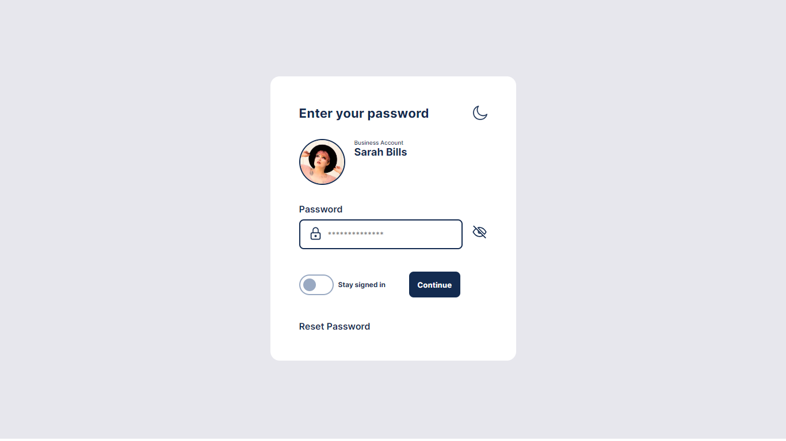
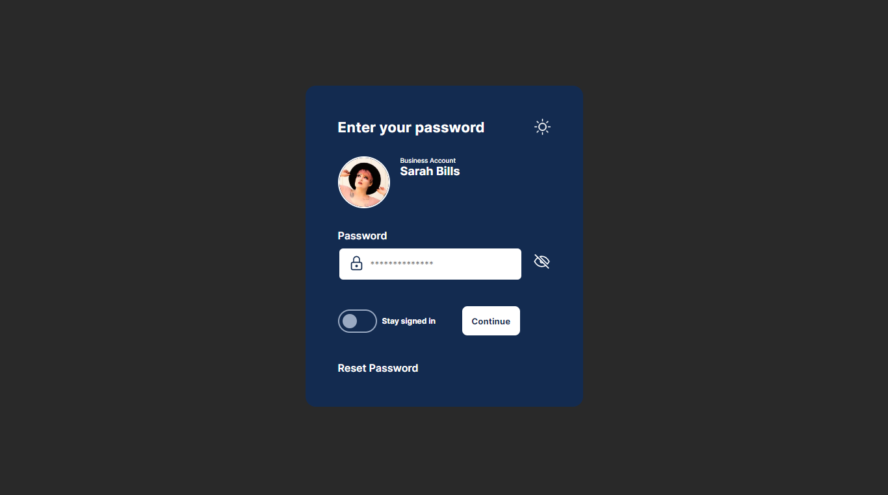

# 🔑 Enter Password Application

## 💻 Sobre

Aplicação <i>web</i> ilustrativa representando um formulário de inserção de senha de usuário.

Colocando em prática conceitos de <i><b>::after</b></i> e <i><b>::before</b></i> do CSS, e evoluindo desenvolvimento utilizando o pré-processador SASS.

Apresenta <i>Toggle Switch</i> e <i>Dark Mode</i>.

## ⭐ Tecnologias

- HTML5;
- CSS3;
- JS; e
- SASS.

## 🖥 Visualização

- 🌞 <i>Light Mode<i>:

- 🌜 <i>Dark Mode:</i>

<a href="https://vitorsantos920.github.io/enterPassword/">Link de Visualização</a>

@Vitor Santos

